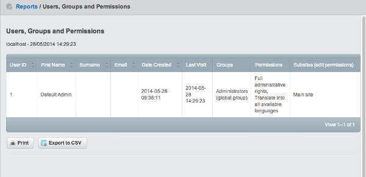

title: Security report
summary: Adds a security overview report in the CMS

## In this section:

* Security report overview
* Subsites support

## Before we begin
Make sure that your SilverStripe installation has the [securityreport](http://addons.silverstripe.org/add-ons/silverstripe/securityreport) module installed.

# Security report

This module adds a "Users, Groups and Permissions" report in the CMS, so that an administrator can get a quick overview of who has access to the CMS.

## Subsites

If the Subsites module is installed then an additional column will be added, allowing you to see which subsites this user can edit pages on.